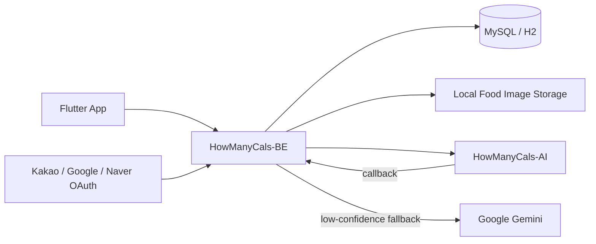
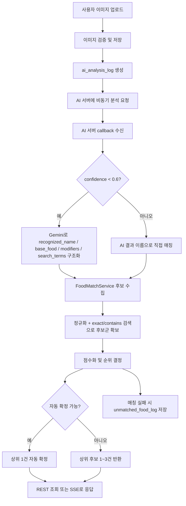
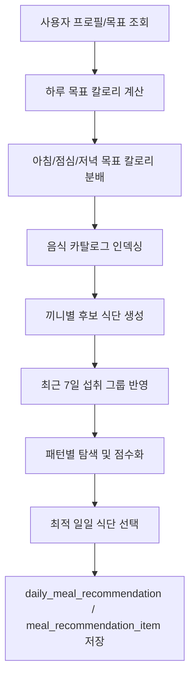
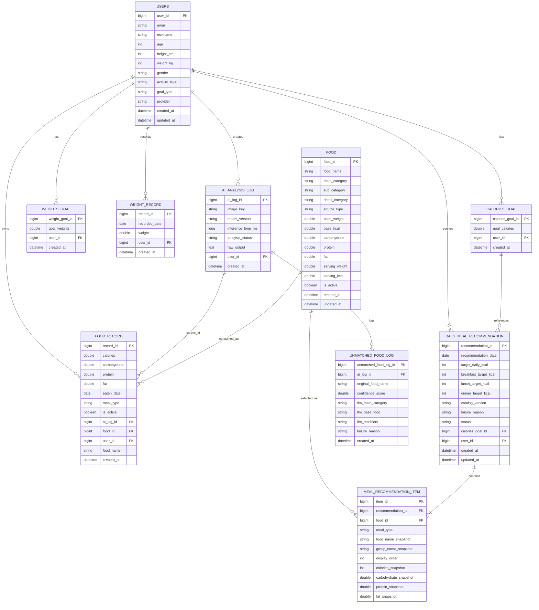

# HowManyCals-BE

오칼몇(HowManyCals)의 백엔드 서버입니다.  
Spring Boot 기반으로 사용자 인증, 음식 이미지 분석 연동, 식단 기록, 체중/목표 관리, 일일 식단 추천 기능을 제공합니다.

## 1. 프로젝트 개요

오칼몇은 사용자가 음식 사진을 업로드하면 AI 분석 결과를 바탕으로 음식명을 매칭하고, 영양 정보를 확인하고, 식단 기록과 추천까지 이어지는 서비스입니다.  
이 저장소는 그중에서도 다음 역할을 담당합니다.

- JWT 기반 인증 및 사용자 프로필 관리
- 카카오·구글·네이버 OAuth 로그인 처리
- 음식 이미지 업로드, AI 서버 비동기 요청, 콜백 수신
- 저신뢰 음식명에 대한 Gemini 기반 LLM 보정
- 음식 DB 매칭 및 수동 검색
- 식사 기록, 체중 기록, 목표 칼로리/체중 관리
- 사용자 상태를 반영한 일일 식단 추천 생성 및 조회

## 2. 기술 스택

- Language: Java 17
- Framework: Spring Boot 4.0.6
- Build: Gradle
- Database: MySQL, H2
- ORM: Spring Data JPA
- Security: Spring Security, JWT
- External Integration: OAuth 2.0, Google Gemini, 별도 AI 추론 서버
- Async Delivery: Server-Sent Events(SSE)
- Deployment: Docker

## 3. 백엔드가 맡는 책임

### 인증과 사용자 관리

- 일반 회원가입/로그인
- OAuth 로그인 후 JWT 발급
- 프로필 수정 및 조회
- 리프레시 토큰 기반 액세스 토큰 재발급

### 음식 분석 파이프라인 오케스트레이션

- 업로드 이미지 검증 및 저장
- `ai_analysis_log` 생성
- AI 서버에 분석 요청 전송
- AI 서버 콜백 수신
- 저신뢰 결과에 대한 LLM 구조화 보정
- 음식 DB 매칭 결과를 SSE 또는 조회 API로 반환

### 건강 데이터 관리

- 식사 기록 저장/조회/삭제
- 체중 기록 저장 및 일/월/년 단위 조회
- 목표 체중/목표 칼로리 저장
- 식단 통계 조회

### 추천 엔진 실행

- 사용자 프로필, 목표, 최근 섭취 패턴, 음식 카탈로그를 입력으로 사용
- 끼니별 목표 칼로리 계산
- 아침/점심/저녁 후보 식단 탐색
- 추천 결과 스냅샷 저장
- 배치 및 수동 생성 모두 지원

## 4. 시스템 아키텍처



## 5. 음식 분석 및 매칭 흐름

이 백엔드의 핵심은 "이미지 분석 결과를 실제 음식 데이터로 얼마나 안정적으로 연결하느냐"입니다.  
현재 구현은 단순한 Levenshtein 단독 매칭이 아니라, 규칙 기반 후보 수집과 점수화, 그리고 저신뢰 케이스용 LLM 보정을 결합한 구조입니다.



### 매칭 로직 요약

- 먼저 음식명, 메인 카테고리, 서브 카테고리를 정규화합니다.
- 식사형 음식과 가공식품을 나누어 후보군을 수집합니다.
- exact 일치, contains 검색, 카테고리 보너스/패널티를 조합해 점수를 계산합니다.
- 점수 차이가 충분하면 자동 확정하고, 애매하면 여러 후보를 FE에 전달합니다.
- 결과가 약하거나 부정확하면 `unmatched_food_log`에 남겨 추후 보정 대상으로 관리합니다.

## 6. 추천 엔진 흐름

추천 기능은 단순 랜덤 추천이 아니라, 목표 칼로리와 식사 패턴을 반영한 탐색 기반 로직으로 동작합니다.



## 7. 주요 API

### Public API

| Method | Path | 설명 |
| --- | --- | --- |
| `GET` | `/status` | 서버 상태 확인 |
| `POST` | `/user/signup` | 일반 회원가입 |
| `POST` | `/user/signin` | 일반 로그인 |
| `GET` | `/auth/oauth/{provider}` | OAuth 인증 시작 |
| `GET` | `/auth/oauth/{provider}/callback` | OAuth 콜백 처리 |
| `POST` | `/auth/refresh` | 액세스 토큰 재발급 |

### Auth Required API

| Method | Path | 설명 |
| --- | --- | --- |
| `GET` | `/user/profile` | 프로필 조회 |
| `PATCH` | `/user/profile` | 프로필 수정 |
| `POST` | `/goal/weight` | 목표 체중 저장 |
| `POST` | `/goal/calories` | 목표 칼로리 저장 |
| `POST` | `/weight/record` | 체중 기록 저장 |
| `GET` | `/weight/summary` | 현재/목표 체중 요약 |
| `GET` | `/weight/records/daily` | 최근 일별 체중 기록 |
| `GET` | `/weight/records/monthly` | 월별 체중 기록 |
| `GET` | `/weight/records/yearly` | 연도별 체중 기록 |
| `POST` | `/food/analyze` | 음식 이미지 분석 요청 |
| `GET` | `/food/analyze/{aiLogId}` | 분석 결과 조회 |
| `GET` | `/food/analyze/{aiLogId}/subscribe` | 분석 결과 SSE 구독 |
| `GET` | `/food/images/{imageKey}` | 저장 이미지 조회 |
| `GET` | `/food/search?query=` | 수동 음식 검색 |
| `POST` | `/food/record` | 식사 기록 저장 |
| `GET` | `/food/record/daily` | 일별 식사 기록 조회 |
| `GET` | `/food/record/monthly` | 월별 캘린더 조회 |
| `DELETE` | `/food/record/{recordId}` | 식사 기록 삭제 |
| `GET` | `/dietlog/stats` | 식단 통계 조회 |
| `GET` | `/recommendations/daily` | 일일 추천 조회 |
| `POST` | `/recommendations/daily/generate` | 일일 추천 생성 |

## 8. 데이터 모델

아래 ERD는 현재 백엔드 도메인 구조를 README에서 바로 볼 수 있도록 Mermaid로 정리한 것입니다.  
실제 엔티티는 `users`, `food`, `food_record`, `ai_analysis_log`, `daily_meal_recommendation` 등을 중심으로 구성됩니다.



## 9. 패키지 구조

```text
src/main/java/ksu/finalproject
├─ domain
│  ├─ analysis        # AI 요청, callback, SSE, LLM fallback
│  ├─ auth            # OAuth 로그인
│  ├─ dietlog         # 식단 통계
│  ├─ food            # 음식 조회, 매칭, 수동 검색
│  ├─ foodrecord      # 식사 기록
│  ├─ goal            # 목표 체중/칼로리
│  ├─ recommendation  # 추천 엔진, 배치, 저장/조회
│  ├─ server          # 헬스체크
│  ├─ user            # 회원/프로필
│  └─ weight          # 체중 기록
└─ global
   ├─ common          # 공통 응답, 예외, 응답 코드
   ├─ config          # 보안, OAuth, JWT, AI, H2 설정
   └─ security        # JWT 필터, 토큰 처리
```

## 10. 실행 방법

### 1) 사전 요구사항

- JDK 17
- Gradle Wrapper
- MySQL 또는 H2
- AI 서버 연동 주소
- OAuth 앱 키
- Gemini API Key

### 2) 설정 파일 준비

`application.yml`은 `.gitignore`에 포함되어 있으므로 직접 생성해야 합니다.  
아래는 예시입니다.

```yaml
server:
  port: 8080

spring:
  datasource:
    url: jdbc:mysql://localhost:3306/howmanycals
    username: root
    password: password
    driver-class-name: com.mysql.cj.jdbc.Driver
  jpa:
    hibernate:
      ddl-auto: update
    open-in-view: false
  h2:
    console:
      enabled: false

jwt:
  secret: your-very-long-jwt-secret-key-at-least-32-bytes
  access-token-expiration: 3600000
  refresh-token-expiration: 1209600000

oauth:
  deep-link: howmanycals://auth
  kakao:
    client-id: your-kakao-client-id
    client-secret: your-kakao-client-secret
    redirect-uri: http://localhost:8080/auth/oauth/kakao/callback
  google:
    client-id: your-google-client-id
    client-secret: your-google-client-secret
    redirect-uri: http://localhost:8080/auth/oauth/google/callback
  naver:
    client-id: your-naver-client-id
    client-secret: your-naver-client-secret
    redirect-uri: http://localhost:8080/auth/oauth/naver/callback

ai:
  server:
    analyze-url: http://localhost:8000/analyze
    api-key: your-ai-server-key
    callback-url: http://localhost:8080/api/ai/callback

google:
  gemini:
    api-key: your-gemini-api-key
    model: gemini-2.5-flash-lite

food:
  image:
    storage-dir: ./private/food-images
    max-file-size: 10485760
    retention-days: 7
```

### 3) 로컬 실행

```bash
./gradlew bootRun
```

Windows에서는 다음 명령을 사용할 수 있습니다.

```powershell
.\gradlew.bat bootRun
```

### 4) Docker 실행

```bash
docker build -t howmanycals-be .
docker run -p 8080:8080 \
  -v $(pwd)/application.yml:/app/application.yml \
  -v $(pwd)/private/food-images:/app/private/food-images \
  howmanycals-be
```

Windows 환경에서는 `$(pwd)` 대신 절대 경로를 사용하면 됩니다.  
실제 운영에서는 `application.yml`, DB 연결 정보, 이미지 저장 디렉터리 볼륨 마운트가 함께 필요합니다.

## 11. 스케줄러

- 음식 이미지 정리: 매일 `03:30` 실행
- 다음날 추천 생성 배치: 매일 `22:00` 실행

## 12. 참고 사항

- 인증이 필요한 대부분의 API는 JWT를 사용합니다.
- 음식 분석 결과는 즉시 완료되지 않을 수 있으므로 `GET /food/analyze/{aiLogId}` 또는 SSE 구독을 사용합니다.
- 저신뢰 분석 결과는 Gemini를 통해 구조화한 뒤 재매칭합니다.
- 추천 결과는 스냅샷 형태로 저장해 이후 원본 음식 데이터가 바뀌더라도 당시 결과를 유지합니다.
